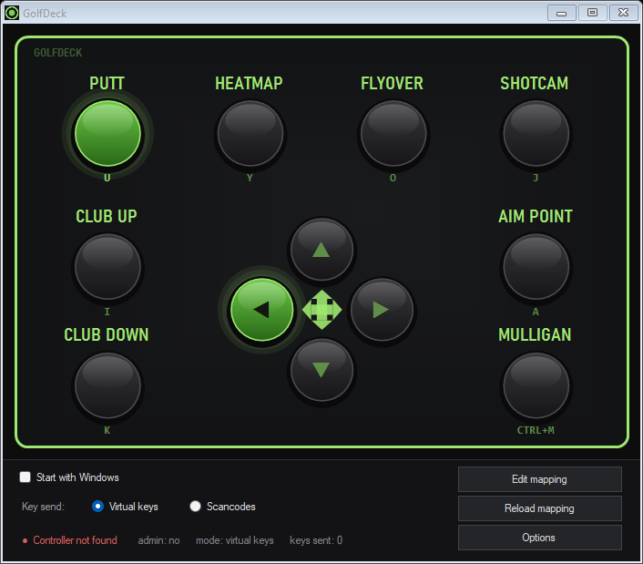
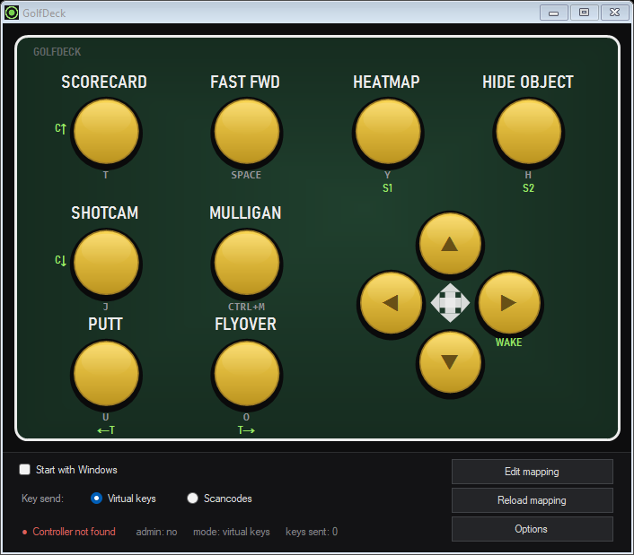
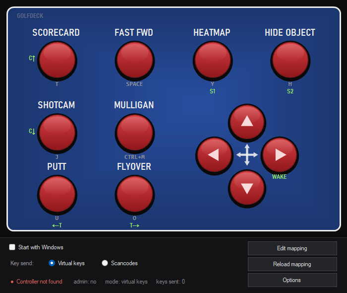

# GolfDeck

Companion app for GSPro control boxes. Reads the box through XInput and sends the matching GSPro keyboard shortcuts. Single portable exe, no install, no dependencies beyond stock Windows 10/11.

**[Download GolfDeck.exe](https://github.com/SenkoeUwU/golfdeck/releases/latest/download/GolfDeck.exe)** - single file, no install.



## Features

- On-screen replica of the physical board. Buttons light up when pressed, so it doubles as a wiring tester. Click a button with the mouse to test its key.
- V1 and V2 board layouts, chosen on first launch, switchable later.
- Edition presets matching the box colorways (Original, Green Jacket, Red & White, Red White & Blue), plus individual board, button and letter colors.
- All bindings in a plain-text `mapping.txt` (per-button key, label, hold/tap/repeat mode). Defaults are the standard GSPro shortcuts.
- Start with Windows (minimized to tray), tray status, restart-as-administrator for elevated GSPro.
- Two key injection modes (virtual keys and scancodes) for games that filter one or the other.
- Built-in update checker: prompts on launch when a new GitHub release exists (with release notes), updates in place. Declining snoozes the prompt for 7 days; check manually any time from Options.




## Install

1. Download `GolfDeck.exe` from the link above and put it anywhere (e.g. `C:\GolfDeck`).
2. Run it and pick your board layout (V1 = PUTT top-left, V2 = SCORECARD top-left). A `mapping.txt` with that layout's GSPro keys is created next to the exe.
3. Plug in the box. Press buttons and watch them light up.
4. Optional: tick "Start with Windows".

Windows SmartScreen may warn about an unknown publisher the first time. The app is unsigned; click "More info", then "Run anyway". See [SETUP.txt](SETUP.txt) for the full walkthrough.

If GSPro runs as administrator, use the tray menu "Restart as administrator" once so keystrokes are not blocked.

## Mapping

`mapping.txt` sits next to the exe and is created on first run. Format:

```
input = keys | label | mode | repeat_ms
```

- inputs: `A B X Y LB RB LT RT Menu View LS RS`, `DPad_*`, `LS_*`, `RS_*` (stick directions)
- keys: `K`, `Ctrl+M`, `Shift+F5`, `Space` and so on
- modes: `hold` (held while pressed), `tap` (once per press), `repeat` (every `repeat_ms` while held)

The board GUI attaches mappings by label, so if a physical button lights the wrong spot, swap the labels in `mapping.txt`. Edit and reload from inside the app.

## Build from source

Run `build.bat`. It uses the C# compiler that ships inside Windows (.NET Framework 4.8), so no SDK install is needed. The whole app is one file, `Program.cs`.

## License

MIT. See [LICENSE](LICENSE).
